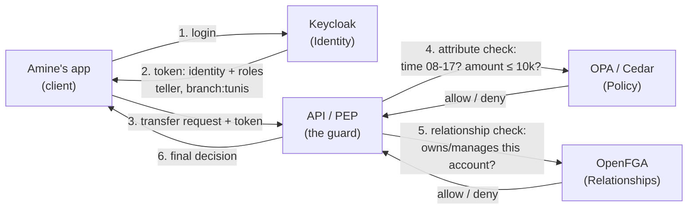

# 🔐 Keycloak — Tool Reference

> **One-line takeaway:** Keycloak is an **identity platform first**, an authorization engine second.
> Its **RBAC is excellent**, its **ABAC is possible but awkward**, and it has **no ReBAC at all**.
> Use it to answer *"who are you and what broad role do you hold?"* — then let OPA / OpenFGA / Cedar
> answer the hard, fine-grained questions.

*(Running example throughout: **SafiBank Cloud**, our SaaS banking platform for Tunisian banks —
tellers, branch managers, customers, accounts in TND, branches in Tunis / Sfax / Sousse.)*

## 🧭 Which models (at a glance)

| RBAC | ABAC | ReBAC | Policy-as-code |
|:----:|:----:|:-----:|:--------------:|
| ✅ great | ⚠️ possible (clunky) | ❌ none | ❌ weak |

*Where it runs:* a standalone **identity platform** (server). *Best at:* identity, SSO, broad roles.

---

## 🧩 What it is

Keycloak is an open-source **Identity and Access Management (IAM)** system. Its main job is
**authentication**: logins, Single Sign-On (SSO), OIDC/SAML, social login, user federation.

It *also* ships an authorization feature called **Authorization Services**, built on the
**UMA 2.0** standard. It can evaluate *"who can do what on which resource"* at request time —
including conditions like time of day, user attributes, or group membership — and returns the
answer inside a special token called an **RPT (Requesting Party Token)**.

---

## ✅ When to reach for Keycloak

- You need **login + SSO + user management** AND coarse **role-based** access, all in one product.
- You want an **open-source, self-hosted** identity system (useful for data-sovereignty — keeping
  Tunisian banking data on your own infrastructure).
- Your access rules are mostly *"this role can do this action"* — no per-object or relationship logic.

## 🚫 When NOT to rely on Keycloak alone

- You need **per-object** decisions (*"only Mr. Youssef's own account"*) → use **OpenFGA** (ReBAC).
- You need rich **attribute rules** (*"amount ≤ 10,000 TND AND during branch hours"*) → use **OPA** or **Cedar**.
- You need **millions of resources** checked fast → Keycloak's UMA/RPT flow won't scale to that.

---

## 1️⃣ How Keycloak does RBAC (its strong suit)

Keycloak's role model is mature and covers the easy 80% cleanly:

| Concept | What it means | SafiBank example |
|---------|---------------|------------------|
| **Realm role** | Global to the whole system | `auditor`, `admin` |
| **Client role** | Scoped to one app | `transfer-service:teller` |
| **Composite role** | A role that bundles other roles | `branch_manager` includes `teller` |
| **Group** | A bucket of users with roles attached | "Tunis Branch Staff" group |

When Amine logs in, his token **already carries** `teller` + `branch:tunis`. Your app just reads
the role from the JWT — **no extra call needed**. Fast and simple. ✅

---

## 2️⃣ How Keycloak does ABAC (possible, but this is where it strains)

Keycloak's **Authorization Services** lets you combine **policy types**:

- role-based · group-based · user-based · client-based
- **time-based** (e.g. 08:00–17:00)
- **aggregated** (combine several policies with AND / OR)
- **JavaScript** rule policies (for custom attribute logic)

So the SafiBank transfer rule *can* be assembled — a **time policy** + a **role policy**, combined
"unanimously" so both must pass. For real attribute comparisons like `user.branch == account.branch`
or `amount <= 10000`, you usually drop into a **JavaScript policy**.

⚠️ **The friction:** those JavaScript policies are security-sensitive. The docs warn that any
attributes used in ABAC must be **read-only** (users must not be able to edit their own
`branch` or `department`). In recent Keycloak versions these scripts typically must be
**deployed as server-side artifacts**, not pasted into the admin console — so iterating is slow.
This is why a dedicated policy engine (OPA/Cedar) is cleaner for ABAC.

---

## 🧪 Worked example — the SafiBank transfer rule, assembled in Keycloak

The canonical rule — *a teller may transfer ≤ 10,000 TND, during branch hours, from an
account in their own branch* — built the Keycloak way, one artifact at a time. *(Illustrative;
exact console fields vary by version.)*

**1. A Role policy** — only staff qualify:
```
Policy type: Role
Name:        teller-or-manager
Roles:       teller, branch_manager   (any)
```

**2. A Time policy** — branch hours only:
```
Policy type: Time
Name:        branch-hours
Not before / Not on-or-after: 08:00 – 17:00
```

**3. A JavaScript policy** — the parts roles and time can't express (amount + same branch),
deployed as a server-side script artifact:
```js
// amount-and-branch.js
var ctx    = $evaluation.getContext();
var attrs  = ctx.getAttributes();
var amount = parseInt(attrs.getValue('amount').asString(0));
var userBr = ctx.getIdentity().getAttributes().getValue('branch').asString(0);
var acctBr = attrs.getValue('account_branch').asString(0);
if (amount <= 10000 && userBr == acctBr) { $evaluation.grant(); }
```

**4. An Aggregated policy** — combine all three, **unanimous** (all must pass):
```
Policy type: Aggregated
Name:        can-transfer
Policies:    teller-or-manager, branch-hours, amount-and-branch
Decision:    Unanimous (AND)
```

**5. A Permission** ties the aggregated policy to the action + resource:
```
Resource: transaction
Scope:    transfer
Apply:    can-transfer
```

At request time Keycloak evaluates `can-transfer` and returns the verdict inside Amine's
**RPT**. *"8,000 TND at 22:00"* → the **Time policy** fails → **deny**. ✅ correct — but note it
took **five artifacts** (one a deployed script) to express what
[`04-policy-as-code`](../../04-policy-as-code/) does in **one** readable, testable Rego file.
That gap is exactly why fine-grained rules usually leave Keycloak.

> 📚 **Want the full treatment?** See the
> [**Keycloak Authorization deep dive**](./authorization-deep-dive.md) — the vocabulary,
> every policy type, real token payloads, the token-bloat math, how to test policies, and the
> feed-OPA/OpenFGA pattern, all with SafiBank examples.

---

## 👍 Avantages

- **All-in-one identity + authZ** — OIDC/SAML login, SSO, user federation *and* RBAC in one product.
- **Mature, expressive RBAC** — realm / client / composite roles + groups cover most real needs.
- **Centralized management** — a UI and REST API to manage policies centrally, so access logic
  isn't copy-pasted across every service.
- **Standards-based** — OAuth2, OIDC, UMA 2.0. No proprietary protocol lock-in.
- **Open-source & self-hostable** — keep data on your own infrastructure.
- **Built-in Evaluation tool** — test a decision before shipping it.

## 👎 Limites

- **ABAC is clunky** — real attribute logic leans on restricted JavaScript policies; harder to
  version and test than Rego (OPA) or Cedar.
- **No ReBAC at all** — cannot model relationship chains like
  `customer → owns → account → belongs to → branch → belongs to → bank`.
- **Doesn't scale to per-object authorization** — don't create a Keycloak "resource" per bank
  account; UMA/RPT round-trips add latency. OpenFGA is built for that volume; Keycloak isn't.
- **Per-object permissions bloat the token** — with the RPT flow, granted permissions are
  carried **inside the token itself** (the RPT is a JWT). Model many resources (say, one per
  account) and the token grows with them:
  - the JWT rides in the `Authorization` header on **every** request → more bandwidth + parsing cost;
  - it can blow past **header/cookie size limits** (proxies and servers often cap headers at
    4–8 KB — an oversized token gets rejected or silently truncated);
  - permissions baked into a token are **hard to revoke** before it expires (you'd wait out the
    TTL or force re-auth);
  - so keep tokens **small and coarse** (identity + broad roles), and resolve per-object access
    at request time with a dedicated engine ([`OpenFGA`](../openfga/)) — don't stuff it into the token.
- **Weak policy-as-code story** — policies live in Keycloak's database, not natively in Git, so
  diffing / CI testing is harder.
- **Enforcement (PEP) is Java-centric** — official policy-enforcer adapters favor Java; other
  stacks often do manual token introspection.

> 📝 **Don't confuse this:** Keycloak 26.2's *Fine-Grained Admin Permissions V2* controls access to
> Keycloak's **own admin resources** (who may administer Keycloak itself). It is **not** a new
> general-purpose ABAC/ReBAC engine for your application.

---

## 🏗️ The pattern that matters: Keycloak *feeds* OPA / OpenFGA

Don't think of Keycloak as competing with OPA/OpenFGA. Think of it as the **identity layer** that
supplies the other engines with a trustworthy identity + roles. Each tool does the part it's best at:

- **Keycloak** → *who are you?* + coarse roles  (identity)
- **OPA / Cedar** → *does the attribute rule pass?* (time, amount)  (policy)
- **OpenFGA** → *do you have the right relationship to this object?* (ownership)



**Plain-English version of the flow:**

```
Amine logs in  → Keycloak gives him a token saying "teller, Tunis branch"
Amine clicks "Transfer 8,000 TND from Youssef's account"
        → API (PEP) reads the token: role & branch come free from Keycloak ✅
        → API asks OPA:     is it 08:00-17:00 and is amount ≤ 10,000? 
        → API asks OpenFGA: does Amine's branch actually hold this account?
        → both say yes → ALLOW   (if it's 22:00 → OPA says DENY)
```

---

## 🧠 One-sentence mental model

> **Keycloak answers *"who are you?"* brilliantly. It answers *"can you move this exact money right now?"* poorly.**
> Use it for identity + broad roles, and delegate the fine-grained decision to a real policy/relationship engine.

---

## 🔗 See also (in this repo)

- [**Keycloak Authorization deep dive**](./authorization-deep-dive.md) — the example-rich, long-form companion to this card.
- [`01-rbac`](../../01-rbac/) — the role concepts Keycloak implements so well
- [`02-abac`](../../02-abac/) — the attribute rules Keycloak struggles with (do these in OPA)
- [`03-rebac`](../../03-rebac/) — the relationship model Keycloak can't do (do this in OpenFGA)
- [`04-policy-as-code`](../../04-policy-as-code/) — why externalizing policy beats scattering `if`
- [`05-tools`](../) — compare Keycloak with the other four tools
