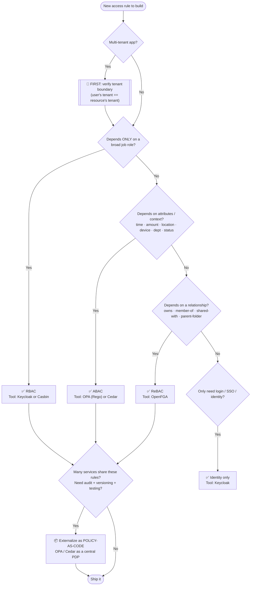

# 🌳 Decision Tree — Which Authorization Model & Tool Should I Use?

> The map. When you have a new access rule to build, start here.
> It tells you **which model** (RBAC / ABAC / ReBAC / Policy-as-Code) and **which tool**
> (Keycloak / Casbin / OPA / Cedar / OpenFGA) to reach for — with examples across many domains.

*(Suggested location in repo: root, or `comparisons/DECISION-TREE.md`.)*

---

## 🧭 How to read this

Every authorization rule is really answering **one question**:

> *Can [subject] do [action] on [resource] in [context]?*

The **shape of that question** tells you the model. The model tells you the tool.
This tree walks you from the question to the answer.

> ⚠️ **Rule 0 — Multi-tenant? Check the tenant boundary FIRST.**
> Before any other check, if your app serves multiple customer organizations, always verify
> *"is this user even allowed to touch THIS tenant's data?"* A leak across tenants is a breach.
> (SafiBank: a DinarBank teller must never reach a Banque de Carthage account — this check runs
> before role, attribute, or relationship checks.)

---

## 🌳 The master decision tree



**Plain-text version (same logic):**

```
Is the app multi-tenant?
   └─ YES → FIRST check: is user allowed in THIS tenant at all?

Then ask, in order:
1. Depends only on a broad ROLE?            → RBAC     → Keycloak / Casbin
2. Depends on ATTRIBUTES / context?         → ABAC     → OPA / Cedar
   (time, amount, location, device, dept)
3. Depends on a RELATIONSHIP?               → ReBAC    → OpenFGA
   (owns, member-of, shared, parent folder)
4. Only need login / identity?             → Identity → Keycloak

Finally:
   Shared across many services + need audit/versioning?
       → Externalize everything as POLICY-AS-CODE (OPA / Cedar PDP)
```

---

## ⚡ Quick lookup: signal → model → tool

| If the rule sounds like…                                   | Model            | Tool               |
|------------------------------------------------------------|------------------|--------------------|
| "Tellers can do X, managers can do Y"                      | **RBAC**         | Keycloak / Casbin  |
| "…but only during working hours / under 10,000 TND"        | **ABAC**         | OPA / Cedar        |
| "…only from the office network / a trusted device"         | **ABAC**         | OPA / Cedar        |
| "…only if they OWN it / it was SHARED with them"           | **ReBAC**        | OpenFGA            |
| "…access flows folder → subfolder → file"                  | **ReBAC**        | OpenFGA            |
| "Keep customer A's data invisible to customer B"           | **Multi-tenant** | tenant check + any |
| "Who is this user? Give me SSO across apps"                | **Identity**     | Keycloak           |
| "Same rules must hold across 5 microservices, and audited" | **Policy-as-Code** | OPA / Cedar (PDP) |

---

## 📍 Where do I enforce it? (the domain branch)

Picking the model is *what*. Picking the **enforcement location** is *where* — and both matter.

```
Single app / API          → check in API middleware (PEP calls the PDP)
Many microservices        → API gateway  +  a shared PDP (OPA/Cedar)  OR  sidecar per service
Kubernetes cluster        → OPA Gatekeeper / Kyverno (admission control)
Service mesh (Istio…)     → sidecar enforcement (Envoy + OPA)
Frontend                  → NEVER trust it for authz; UI hints only, real check is server-side
```

---

## 🧪 Worked examples across apps & domains

Each shows: **the requirement → the model(s) → the tool(s) → why.**

### 1. 🏦 SaaS Banking — *SafiBank Cloud* (multi-tenant)
- **Requirement:** "A teller may transfer ≤ 10,000 TND during branch hours, only for accounts in
  their own branch, and only within their own bank."
- **Models:** Multi-tenant boundary **+ RBAC** (teller) **+ ABAC** (amount, hours, branch)
- **Tools:** Keycloak (identity + role) → OPA (attribute rule); tenant check first
- **Why:** roles alone can't express amount/time; banking needs audit → policy-as-code.

### 2. 📄 Document Collaboration — *Drive / Notion-like*
- **Requirement:** "You can edit this doc if you own it, or it was shared with you, or you're in the
  team that owns its parent folder."
- **Model:** **ReBAC** (pure relationships + inheritance)
- **Tool:** OpenFGA
- **Why:** it's all *owns / shared-with / parent-of* chains — the textbook Zanzibar case. Roles and
  attributes can't model sharing trees cleanly.

### 3. 🏥 Healthcare — *Hospital records system*
- **Requirement:** "A doctor can read a patient's file only if assigned to that patient, during their
  shift, and only within their department — except in an emergency 'break-glass' override."
- **Models:** **ReBAC** (assigned-to patient) **+ ABAC** (shift time, department, emergency flag)
- **Tools:** OpenFGA (relationship) + OPA/Cedar (context)
- **Why:** "assigned-to" is a relationship; "during shift / emergency" is attributes. Needs both,
  plus airtight audit (HIPAA-style) → policy-as-code.

### 4. 🛒 E-commerce Marketplace — *multi-vendor shop*
- **Requirement:** "A seller can edit only their own products; a buyer sees only their own orders;
  a support agent can view any order but refund only up to 500 TND."
- **Models:** **RBAC** (seller / buyer / agent) **+ ReBAC** (owns product/order) **+ ABAC** (refund cap)
- **Tools:** Keycloak (roles) + OpenFGA (ownership) + OPA (refund limit)
- **Why:** classic real-world blend — this is why modern systems layer all three.

### 5. ☸️ Cloud Platform — *Kubernetes / DevOps*
- **Requirement:** "Only signed images from our registry may deploy; no container runs as root;
  dev team deploys only to the `dev` namespace."
- **Models:** **Policy-as-Code** (cluster rules) **+ RBAC** (K8s native namespace roles)
- **Tools:** OPA Gatekeeper / Kyverno (admission control) + Kubernetes RBAC
- **Why:** enforcement happens at the cluster admission layer, not in app code — a *domain* choice.

### 6. 🏛️ E-Government — *Tunisian citizen services portal*
- **Requirement:** "A citizen sees only their own records (by CIN); an agent in the Sfax office
  handles only Sfax-region requests; some documents need two approvers."
- **Models:** Multi-tenant-ish (region isolation) **+ ReBAC** (owns record) **+ ABAC** (region, approval count)
- **Tools:** Keycloak (national identity/SSO) + OpenFGA (ownership) + OPA (region + approval rules)
- **Why:** identity is central and shared; ownership + regional context drive the rest.

---

## 🎯 The honest truth: real systems COMBINE

Notice the pattern in every example above — **almost nothing uses just one model.** The mature
architecture is layered:

```
Keycloak     → identity + broad roles      (WHO are you)
OPA / Cedar  → attribute & context rules    (do the CONDITIONS pass)
OpenFGA      → relationship & ownership      (RIGHT connection to this object)
        ↓ all externalized as ↓
Policy-as-Code → versioned in Git, tested, audited, one source of truth
```

RBAC → ABAC → ReBAC → Policy-as-Code isn't a "pick one" menu — it's **layers you add as the
requirement gets sharper.** Start with the simplest that answers your question; add the next layer
only when the current one can't express the rule.

---

## 🧠 TL;DR — the one-paragraph rule

> Start with **RBAC** (roles) because it's simplest. The moment a rule needs **time, amount, location,
> or status**, add **ABAC**. The moment it needs **ownership, sharing, or hierarchy**, add **ReBAC**.
> Once these rules are spread across services or must be audited, **externalize them as
> policy-as-code** behind a single PDP. And if you're multi-tenant, **check the tenant boundary
> before anything else.** Use **Keycloak** for identity, **OPA/Cedar** for policy, **OpenFGA** for
> relationships — together, not in competition.

---

## 🔗 See also (in this repo)

- `00-foundations/` — the "one question" this whole tree is built on
- `01-rbac/` · `02-abac/` · `03-rebac/` · `04-policy-as-code/` — each model in depth
- `05-tools/` — one reference per tool (Keycloak, Casbin, OPA, Cedar, OpenFGA)
- `06-domains/` — the *where you enforce* branch (APIs, SaaS, Kubernetes, cloud-native)
- `comparisons/` — deeper side-by-side of models and tools
